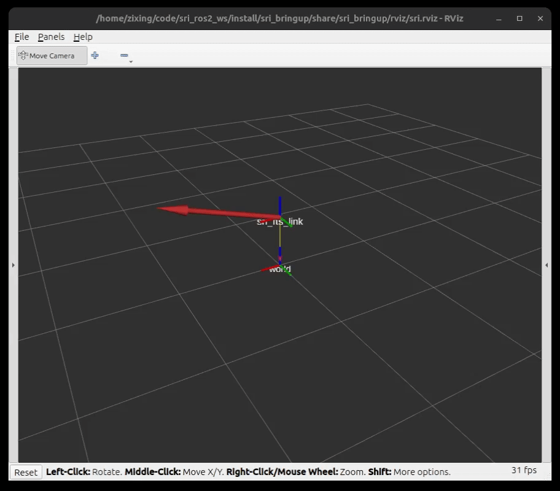

# Sunrise Instruments ROS2
This repository includes a `ros2_control` driver for [Sunrise Instruments (SRI)](https://www.srisensor.com/) 6 axis force/torque sensors.

## System Requirements
ROS2 Jazzy on Ubuntu 24.04 LTS. 

## Compatible devices
The driver has currently been tested on the following SRI force/torque sensors:
- [M3733C](https://www.srisensor.com/m37xx-series-6-axis-ft-sensor-for-robot-general-testing-product/) 6 axis F/T load cell with [M8128B1](https://www.srisensor.com/data-acquisition-interface-box-m812x-product/) data acquisition interface box

## Packages in this Repository
- `sri_bringup` - launch and config files to bring up the SRI F/T sensor, it also serves as an example usage of the driver
- `sri_description` - URDF description and ros2_control tags for the SRI F/T sensor
- `sri_hardware` - hardware interface for the SRI F/T sensor

## Getting Started
1. **Clone this repository in your ros2 workspace**. Take `sri_ros2_ws` as an example:
   ```bash
   mkdir -p sri_ros2_ws/src
   cd sri_ros2_ws/src
   git clone https://github.com/zixingjiang/sunrise_instruments_ros2.git
   ```
2. **Install dependencies**
   ```bash
   cd sri_ros2_ws
   rosdep update --rosdistro=$ROS_DISTRO
   sudo apt update
   rosdep install --from-paths ./ -i -y --rosdistro ${ROS_DISTRO}
   ```
3. **Build and source the workspace**
   ```bash
   colcon build
   source install/setup.bash
   ```
4. **Connect to sensor and bring up the driver**. Connect the data acquisition interface box via Ethernet to the computer running the driver. You can bring up the driver with the command below. You need to pass the sensor's IP and port to the driver via `sensor_ip` and `sensor_port` arguments. (optional) You can also pass `gui:=true` to visualize the sensor data in RViz and distinguish a sensor via `sensor_name`, which is useful in multi-sensor layout.    
   ```bash
   # replace <sensor_ip>, <sensor_port>, <sensor_name> with your sensor's IP, port, and name
   ros2 launch sri_bringup sri.launch.py sensor_ip:=<sensor_ip> sensor_port:=<sensor_port> gui:=true sensor_name:=<sensor_name>
   ```
   If you set `gui:=true`, after the driver has started successfully you will see the following window where the forces and torques are visualized.

   
5. **Access the data**. After the driver is started, your `ros2_control` controllers can access the force/torque data through the following state interfaces (there will be a prefix `<sensor_name>_` if you pass `sensor_name:=<sensor_name>` to the driver, e.g. `sri_ft_sensor/force.x` becomes `<sensor_name>_sri_ft_sensor/force.x`):
   - `sri_ft_sensor/force.x`
   - `sri_ft_sensor/force.y`
   - `sri_ft_sensor/force.z`
   - `sri_ft_sensor/torque.x`
   - `sri_ft_sensor/torque.y`
   - `sri_ft_sensor/torque.z`
  
   This driver also starts a [force_torque_sensor_broadcaster](https://control.ros.org/jazzy/doc/ros2_controllers/force_torque_sensor_broadcaster/doc/userdoc.html) automatically, which broadcasts the force/torque data as a `geometry_msgs/WrenchStamped` message on the `/sri_fts_broadcaster/wrench` topic. You may subscribe to this topic for other applications, e.g. visualization and data logging.

## Use this Driver in your Own Robot
To use this driver in your own robot, you need to:
- Include sensor's URDF description and ros2_control tags in your robot's URDF file. 
- Modify your `controller_manager` configuration file and launch file to configure and spawn controllers/broadcaster for the sensor according to your needs.

You may take the `sri_bringup` package as an example.


## Acknowledgements
This driver is written with reference to the following repositories:
- [ICube-Robotics/forcedimension_ros2](https://github.com/ICube-Robotics/forcedimension_ros2)
- [ros-controls/ros2_control_demos](https://github.com/ros-controls/ros2_control_demos), especially **Example 5**
- [UniversalRobots/Universal_Robots_ROS2_Driver](https://github.com/UniversalRobots/Universal_Robots_ROS2_Driver)
